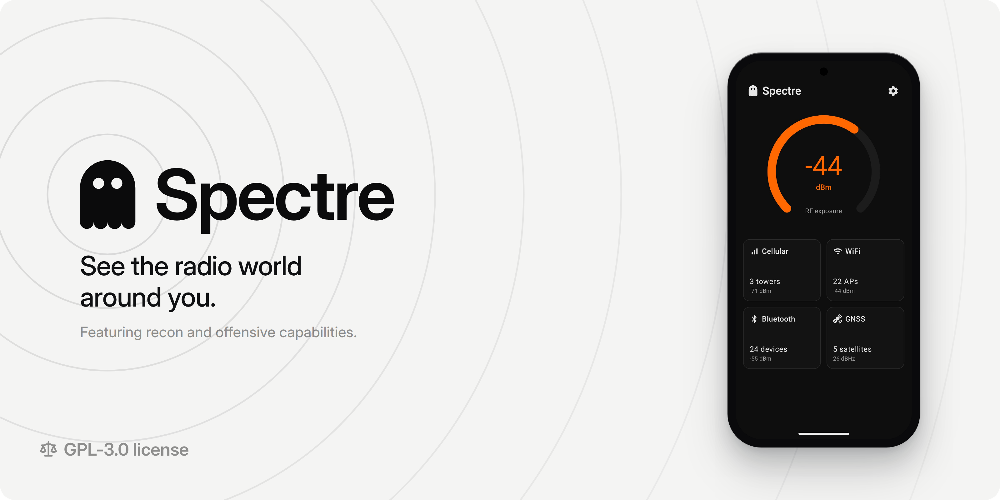

**Spectre** is an Android app for observing and interacting with the wireless environment around you. It monitors signals from Bluetooth devices, Wi-Fi access points, cellular towers, and GNSS satellites. Spectre also features a growing set of pentesting tools, constrained by Android's security model.

## Installation

**Minimum supported version: Android 12 (API 31)**

1. Download the APK from the [GitHub release](https://github.com/thomasbuilds/Spectre/releases/latest) or on [F-Droid](https://f-droid.org/packages/dev.thomasbuilds.spectre)
2. Optionally verify the APK's signing certificate against the [CERT.sha256](CERT.sha256) fingerprint.
3. Open the file on your phone and allow installation from unknown sources when Android prompts you.
4. Launch Spectre and grant the permissions it requests.

## Features

- **Live RF exposure gauge:** A single dBm figure for the total received RF power across cellular, Wi-Fi, and Bluetooth.
- **Cellular:** Serving and neighbor cells on 5G, 4G, 3G, and 2G with operator, identifiers, bands, reference measurements, and a timing-advance distance estimate where available.
- **Wi-Fi:** Access points on the 2.4, 5, and 6 GHz bands with vendor, security, cipher, channel, width, and a distance estimate (true 802.11mc FTM ranging where the hardware supports it).
- **Bluetooth LE:** Advertising devices with name, MAC, vendor, RSSI, address type, PHY, service UUIDs, and decoded manufacturer data including iBeacon.
- **GNSS:** Multi-constellation tracking with dual-frequency support, carrier-to-noise, elevation, azimuth, used-in-fix status, and a computed sub-satellite ground point.
- **Local-network scan:** Host discovery via TCP-connect probes and SSDP / UPnP, with banner grabbing, service fingerprinting, and reverse DNS, plus mDNS / DNS-SD service discovery.
- **GATT inspector:** Connect to a BLE device, enumerate its services and characteristics, read and decode their values, and write to writable ones.
- **iBeacon broadcast:** Broadcast as an iBeacon with configurable UUID, major, minor, and measured power.

## Android limitations

**Signal strength is a reference measurement, not total power.** Modems report RSRP (4G/5G) or RSCP (3G), the power of a single reference element, not the power of the whole channel. Spectre reconstructs a wideband estimate per network type. LTE uses the modem's own RSSI when it exposes one, otherwise a bandwidth-derived offset. NR (5G) uses a fixed offset because Android does not expose the NR channel bandwidth at all. WCDMA derives it from Ec/No, and GSM is already a total-power figure. The result is usually within a few dB of the true value.

**Powers cannot be added in dBm.** dBm is logarithmic, so per-emitter strengths cannot meaningfully be summed. Spectre converts each to linear power (milliwatts), adds them, and converts back, so the exposure figure is dominated by the strongest emitters, which is the physically correct result for total received power. Cellular readings are first normalized to the wideband-equivalent figure above, so they are comparable to Wi-Fi and Bluetooth.

**5G NSA is invisible.** On most 5G networks the phone rides on a 4G anchor cell and adds a 5G carrier on top, and Android exposes only the 4G anchor to apps. The strength shown for a connected 5G NSA cell is therefore the anchor's, not the 5G signal carrying the data. Only standalone 5G (5G SA) returns a real 5G reading. This cannot be worked around, so it is disclosed clearly in the app.

**Only your carrier's cells appear.** The modem decodes only the spectrum your SIM's network and its roaming partners use, so cells from other carriers never show up. Android's telephony APIs also report a single subscription by default, so Spectre monitors every active SIM to cover both carriers on a dual-SIM phone.

**Wi-Fi scan throttling.** Android limits an app to roughly four Wi-Fi scans every two minutes. Spectre paces itself to about one scan every 30 seconds while throttling is on, and faster once it is disabled in Developer options. It also consumes the results of system-initiated scans, so the list keeps updating even when its own scans are throttled.

**Distance is not handed to you.** Android gives no distance to most emitters. Spectre uses true ranging where it exists (Wi-Fi 802.11mc FTM, cellular timing advance) and a path-loss model otherwise, calibrated from the iBeacon measured-power field when present, and labels every estimate with its confidence so you know which is which.

## Sponsor

Spectre is free, open-source, and ad-free. Donations toward its continued development are very welcome.

- Bitcoin: `bc1qphgd8leqsf06qlm6jjxpuw2rtq9f9hdjnhfluh`
- Monero: `85fzziWM1pH77HWHNhE6aAN9uaHrLL7CMFA72rVecmMDR1fUjfv9YmS6GGeiV3hDEn7e9d8v4hfMSRmmEp171fpR4nipNfZ`
